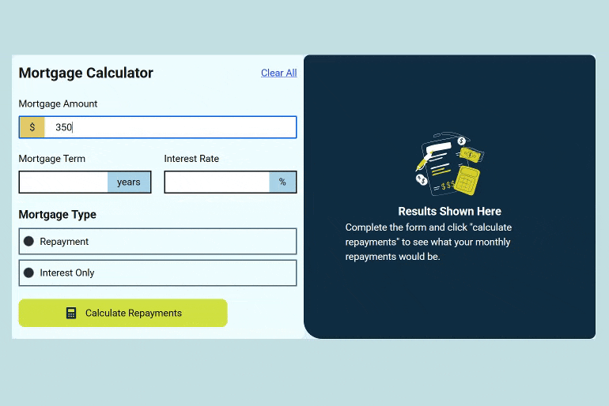

# Mortgage Repayment Calculator

A responsive financial tool that allows users to estimate their monthly mortgage repayments based on principal, term, and interest rate. Built with vanilla JavaScript to handle real-time calculation logic and currency formatting.

## 🔗 Links

- **Live Demo Link:**

## 🧮 Mortgage Calculator Showcase

## 🧐 About The Project

This project focuses on DOM manipulation and mathematical logic. The goal was to create a calculator that is not only accurate but also user-friendly. It handles distinct calculation formulas for "Repayment" (Principal + Interest) versus "Interest Only" loans and updates the DOM dynamically to display the results.

It emphasizes data readability by automatically formatting large numbers as users type, preventing the common user error of miscounting zeros.

### Key Features

- **Dual Calculation Modes:**
  - **Repayment:** Calculates monthly payments covering both the principal and interest.
  - **Interest Only:** Calculates payments covering only the accrued interest.
- **Dynamic Number Formatting:** Implements a regex-based formatter that automatically inserts commas (e.g., converting `350000` to `350,000`) to improve readability for large currency figures.
- **Input Validation:** Restricts input fields to numeric values only, preventing calculation errors caused by invalid characters.
- **State Management:**
  - **Results View:** Dynamically swaps the "empty state" illustration for the results panel upon calculation.
  - **Clear Function:** A global reset button that clears all inputs and reverts the dashboard to its initial state.

## 🛠️ Technologies Used

- **HTML** for the calculator structure and radio button groups.
- **CSS** for the dashboard layout, utilizing a split-pane design (Input vs. Result) and responsive flexbox handling.
- **JavaScript(ES6+)** for the mortgage formulas, event listeners, and string manipulation for currency formatting.
